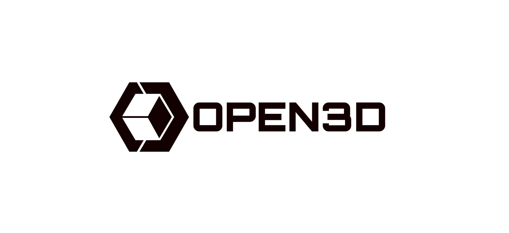

## 简介
Open3D是一个开源库，旨在使3D数据处理更加易于访问和高效。它支持从3D数据处理到3D深度学习的广泛操作，提供了从基本的数据结构到最先进的算法实现等一系列功能。使用Open3D，用户可以轻松地进行点云处理、网格操作、3D数据可视化等任务。

该库是用C++开发的，并且提供了Python接口，这使得它既适合需要高性能的应用场景也适合快速原型设计和脚本编写。Open3D的设计考虑了与PyTorch等深度学习框架的兼容性，因此非常适合涉及3D深度学习的研究和应用。

Open3D的功能包括但不限于：

- **3D数据读写**：支持多种3D数据格式，如PLY、STL、OBJ等。
- **点云处理**：提供点云滤波、下采样、法线估计、特征计算等功能。
- **网格处理**：支持网格简化、重建、平滑等操作。
- **3D可视化**：内置了强大的可视化工具，便于用户直观地查看和交互式探索3D数据。
- **3D机器学习**：集成了对3D深度学习的支持，允许用户直接在3D数据上训练模型。


## 1、可视化
```python
python 01_visulization.py
```
 - [open3d_visulization](./assets/open3d_visulization.md)


## 2、滤波去噪

### 2.1 统计滤波、半径滤波
```python
python 02_filtered.py
```

### 2.2 下采样、欧式聚类分割（基础）

```python
python 02_voxel_ds_DBSCAN_01.py
```
#### ✅ 支持的场景类型
| 类型 | 描述 | 示例 |
|------|------|------|
| `'ground'` | 地面平坦区域 | 无人驾驶、机器人导航等场景 |
| `'building'` | 建筑物结构 | 城市建模、BIM 等 |
| `'vegetation'` | 植被、树木 | 园林扫描、森林 LiDAR |
| `'lidar'` | 通用 LiDAR 扫描 | 不明确场景时的默认值 |

#### 🧠 参数策略说明
| 参数 | 含义 | 地面 | 建筑 | 植被 | LiDAR（默认） |
|------|------|------|------|------|----------------|
| `voxel_size` | 下采样粒度 | 0.05~0.1 m | 0.1~0.2 m | 0.05~0.1 m | 0.1 m |
| `eps` | DBSCAN 邻域半径 | 0.3 m | 0.5 m | 0.2 m | 0.3 m |
| `min_points` | 成簇最小点数 | 10 | 20 | 5 | 10 |
| `min_cluster_size` | 最小簇大小 | 50 | 100 | 20 | 50 |

### 2.3 下采样、欧式聚类分割（进阶）

```python
python 02_voxel_ds_DBSCAN_02.py
```

---

#### 📌 三、功能说明总结
| 功能 | 描述 |
|------|------|
| ✅ 单位检测 | 判断点云是否为 mm 或 m |
| ✅ 自动缩放 | 统一转换为米制单位，避免参数错误 |
| ✅ 场景识别 | 支持地面、建筑、植被、通用 LiDAR 四种类型 |
| ✅ 颜色保留 | 若输入有颜色信息则保留输出颜色 |
| ✅ 对比可视化 | 分别展示原始点云与去噪后点云 |


#### 🧠 为什么需要“单位检测 + 统一缩放”？

点云数据可能来自不同设备（如 LiDAR、RGB-D 相机、SfM 等），其单位可能是：
- **毫米（mm）**：常见于某些激光雷达或工业扫描仪
- **米（m）**：常见于 SLAM 或航拍重建

如果不统一单位，可能导致 DBSCAN 参数失效（例如 `eps=0.3` 在毫米下是 30cm，在米下是 30cm，但如果点云是 mm 单位却按 m 处理，就会误判为噪声）。

